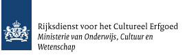
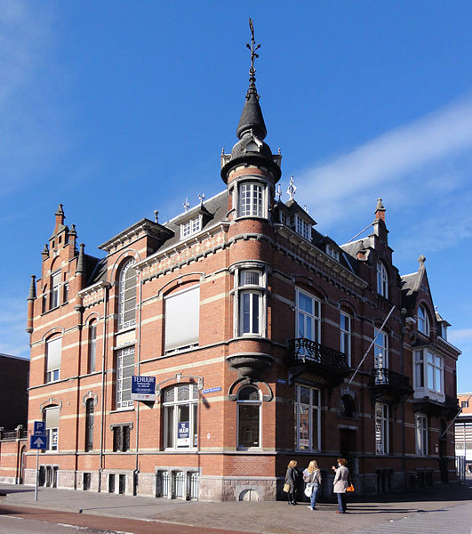

Wikimedia Nederland
===================
* Hay Kranen
* Adviseur culturele samenwerkingen
* Wikimedia Nederland
* [@huskyr](http://twitter.com/huskyr)

    

Wikipedia
=========

    

Rijksmonumenten database
========================

* Rijksdienst voor cultureel erfgoed
* Lijst met rijksmonumenten (bijna 61.000!)
* Wikimedia kreeg de complete lijst voor gebruik op Wikipedia

Lijsten op Wikipedia
====================
* [DE LIJST](http://nl.wikipedia.org/wiki/Lijsten_van_rijksmonumenten_per_provincie)
* [Aalten](http://nl.wikipedia.org/wiki/Lijst_van_rijksmonumenten_in_Aalten_(gemeente))

Foto's?
=======

* [Wiki Loves Monuments](http://wikilovesmonuments.nl/)
* [Heel veel foto's!](http://commons.wikimedia.org/wiki/Category:Images_from_Wiki_Loves_Monuments)

Licentievrij
============

Resultaten
==========
* 12.573 foto's!
* [Haarlem](http://nl.wikipedia.org/wiki/Lijst_van_rijksmonumenten_in_Haarlem/Centrum_(Spaarnwouderbuurt))
* Maar nog niet alles :)
* [Foto](http://commons.wikimedia.org/wiki/File:'s-Hertogenbosch_Rijksmonument_21584_Berewouthof.JPG)
* [Data](http://www.kich.nl/kich2010/rapport.jsp?id_qualifier=ODB:Rijksmonumentnr&id=21584)

Dankjewel!
==========

Foto: Havang(nl) / CC-BY-SA

Bronnen
=======
* [http://www.haykranen.nl/pres/nerdsunite](http://www.haykranen.nl/pres/nerdsunite/#slide9)
* [http://www.haykranen.nl/pres/nerdsunite/pres.md](http://www.haykranen.nl/pres/nerdsunite/pres.md)
* [http://www.wmnederland.nl](http://www.wmnederland.nl)
* Gemaakt met [Slideshow (S9)](http://slideshow.rubyforge.org/) en [Google Rocks slides](http://github.com/geraldb/slideshow-google-html5-slides)